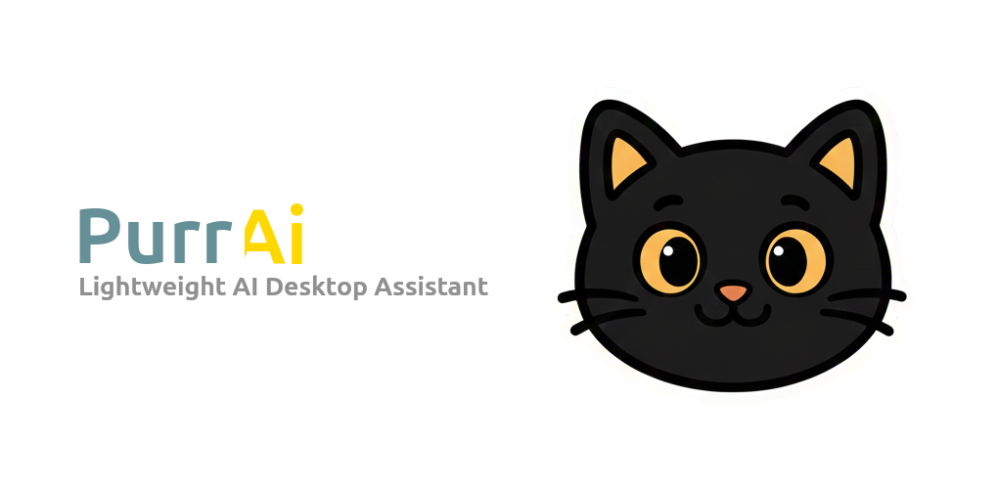

<div align="center">



# {PurrAI}

**Your adorable AI companion living in your machine**

[](https://laravel.com)
[](https://nativephp.com)
[](https://alpinejs.dev)
[](https://tailwindcss.com)
[](LICENSE)

[Features](#-features) • [Installation](#-installation) • [Usage](#-usage) • [Configuration](#-configuration) • [Tech Stack](#-tech-stack)

</div>

## 🌟 Overview

**PurrAI** is a lightweight, cross-platform desktop application that brings the power of AI to your fingertips. With a cute black kitten mascot living in your system's, you can instantly access AI assistance for any task—from answering questions to analyzing images and documents.

Built with modern web technologies and packaged as a native application, PurrAI runs seamlessly on **Linux**, **Windows**, and **macOS** while maintaining a minimal footprint.

---

## ✨ Features

### 🎯 Core Capabilities

- **🔑 Multi-Provider Support** - Configure multiple AI providers (OpenAI, Anthropic, Ollama, etc.)
- **💬 Intelligent Chat Interface** - Natural conversation with AI powered by PrismPHP
- **🖼️ Image Analysis** - Paste images for AI processing
- **📎 Document Attachment** - Upload and analyze documents of any type (past, drag  and drop, etc.)
- **📝 Text Analysis** - Analyze text from any source.
- **💾 Conversation History** - All chats saved locally in SQLite with search
- **🌓 Dark/Light Mode** - Beautiful interface that adapts to your system theme
- **🔒 Privacy-Focused** - Local Ollama models and WhisperCPP (for audio) run in your system without exposing your data
- **🌐 i18n Support** - Available in multiple languages

---

## 🚀 Installation

### Prerequisites

- PHP 8.4+
- Composer
- Node.js 18+ & npm 10+
- SQLite

### Setup

```bash
# Clone the repository
git clone https://github.com/b7s/purrai.git
cd purrai

# Install PHP dependencies
composer install

# Install JavaScript dependencies
npm install

# Copy environment file
cp .env.example .env

# Publishing the Electron project
php artisan native:install --publish
```

#### Fix Linux Permissions for production

After run `native:install`, add "afterInstall" to your `nativephp/electron/electron-builder.mjs` (if "deb" not exists, add it after "linux"):

```js
   linux: {
      /*...*/
   },
   deb: {
      afterInstall: "../../scripts/fix-permission-linux-app-after-install.tpl",
   },
```

_It will attempt to correct permission issues when installing the builded app in "/opt"._

> **Attention:** Whenever you update the project (`composer update`), the files in "nativephp" will be overwritten and you will need to add the script again.


Make sure to run `sudo chmod +x scripts/fix-permission-linux-app-after-install.tpl` after install.

---

## 🎮 Usage

### Starting the Application

```bash
# Development mode
composer native:dev

# Production build
php artisan native:build
```

#### Linux permissions for development

Ensure the correct privileges for Electron while performing your tests. Use the command:

```bash
bash scripts/fix-electron-sandbox.sh
```

> _Make the file executable before running it: `chmod +x scripts/fix-electron-sandbox.sh`_


### First Time Setup

1. Click the kitten icon in your menu bar
2. Navigate to Settings (⚙️)
3. Add your AI provider API keys:
   - OpenAI
   - Anthropic Claude
   - Google Gemini
   - Or configure local Ollama

### Using the Assistant

1. **Start a conversation** - Type your question in the input box
2. **Attach files** - Click the attachment icon to upload documents
3. **Paste images** - Use Ctrl+V (Cmd+V on Mac) to paste screenshots
4. **View history** - Click the history dropdown to browse past conversations
5. **New chat** - Click the new chat button to start fresh

---

## ⚙️ Configuration

### AI Provider Setup

Navigate to Settings to configure your preferred AI providers:

```php
// Supported providers via PrismPHP
- OpenAI (GPT)
- Anthropic (Claude)
- Google (Gemini)
- Ollama (Local models)
- And more...
```

### Local Ollama Setup

For privacy-focused users, configure Ollama to run AI models locally:

1. Install [Ollama](https://ollama.ai)
2. Pull your preferred model: `ollama pull llama2`
3. Add Ollama endpoint in Settings
4. Select local model in chat

---

## 🛠️ Tech Stack (🙏 Acknowledgments)

### Backend
- **[Laravel 12](https://laravel.com)** - Modern PHP framework
- **[Livewire 3](https://livewire.laravel.com)** - Reactive components
- **[SQLite](https://www.sqlite.org)** - Lightweight database
- **[PrismPHP](https://prismphp.com)** - Multi-provider AI integration

### Frontend
- **[Alpine.js 3](https://alpinejs.dev)** - Minimal JavaScript framework
- **[Tailwind CSS 4](https://tailwindcss.com)** - Utility-first CSS with Glassmorphism style
- **[Iconoir](https://iconoir.com)** - Beautiful open-source icon library (CSS)
- **Blade Templates** - Laravel's templating engine

### Native Application
- **[NativePHP 2](https://nativephp.com)** - Cross-platform desktop wrapper
- **[Electron](https://www.electronjs.org/)** - Native application runtime

---

## 🤝 Contributing

Contributions are welcome! Please feel free to submit a Pull Request.

1. Fork the repository
2. Create your feature branch (`git checkout -b feature/AmazingFeature`)
3. Commit your changes (`git commit -m 'Add some AmazingFeature'`)
4. Push to the branch (`git push origin feature/AmazingFeature`)
5. Open a Pull Request

---

## 📝 License

This project is licensed under the MIT License - see the [LICENSE](LICENSE) file for details.

---

<div align="center">

**Made with ❤️ and 🐱 by Bruno**

[Report Bug](https://github.com/b7s/purrai/issues) • [Request Feature](https://github.com/b7s/purrai/issues)

</div>
